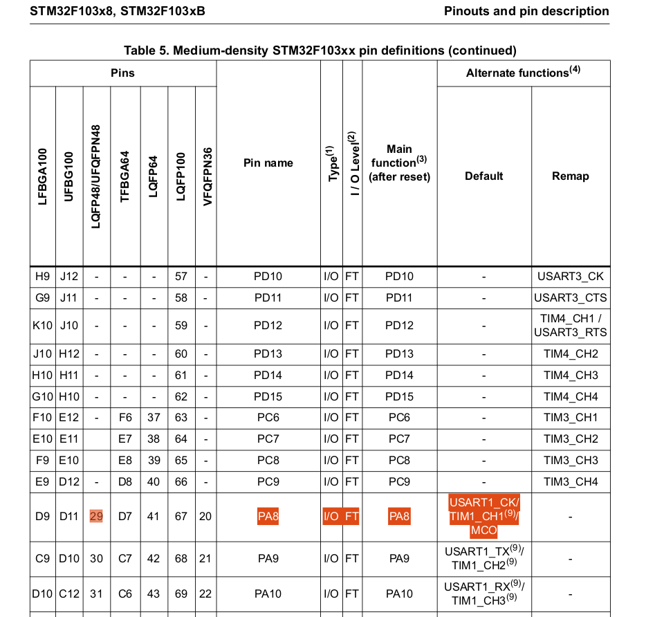
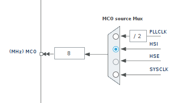
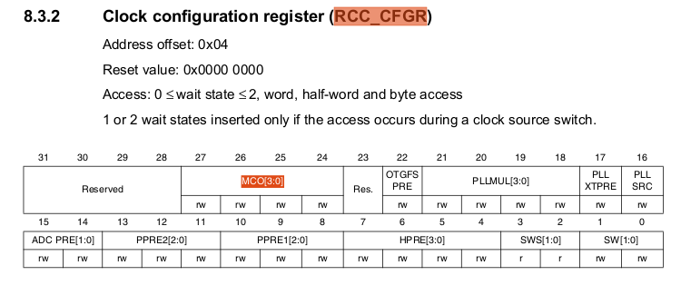
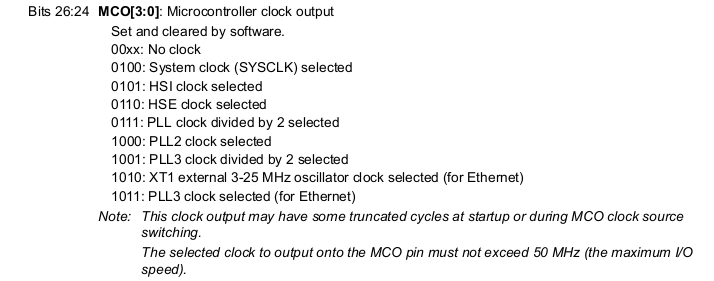
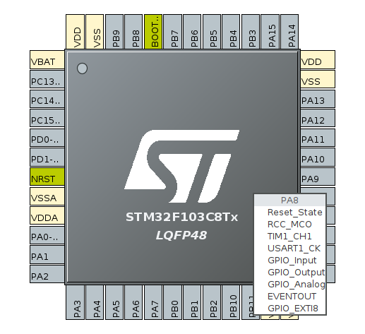
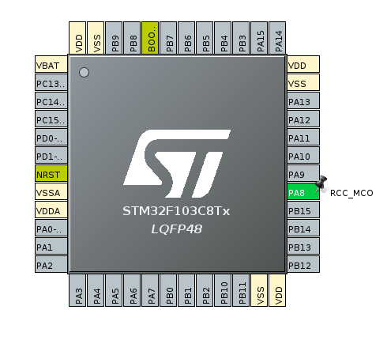

# Lets Measure the HSI Clock

The HSI Clock is the clock signal generated by its internal RC oscillator. In STM32F108C6 it is of 8 MHz and by default after power-on/reset it is used as main system clock (SYSCLK).

 

>I cannot resist my self to bring my analogy for MCU Clock source and clock signal is that**this MCU is operating on internal heart (RC oscillator) which is beating at the rate of 8 MHz.**
>
>Which simply means **this heart is beating every (1/(8 * 10^6)) Seconds = 125 ns (Clock Period).**
>
>**And it will beat (10^9)/125 = 8000000 times per sec (Numbers of Clock Period in one seconds).**

 

But is there any way through which i can see this clock signal (Heart beats) and also measures its frequency (Heart Rate).

Okay Let me formulate it as an Task.

**So now the task is to output this clock to MCU I/O pin and measure its frequency with the help of some tool.**

The approach to this task is as follows:

1. Output the Clock on Microcontroller Output pin (MCO) (Basically via writing Code)

    - Select the desired clock for the MCO signal.

    - Output the MCO Signal to MCU MCO pin.

2. Capturing the signal on MCOx pin using Logic Analyzer/Oscilloscope.

 

## Lets Accomplish this Task
#

## **1) First lets find out MCOx pin on STM32F103C8 using its Datasheet**

 

**Please find Datasheet here /Datasheet/stm32f103c8.pdf**

 

  

From the above image PA8 pin can be configured as MCO pin.

## **2) Now lets explore the register for making PA8 as MCO pin using STM32F108C8 Reference Manaual**
#
**Please find Datasheet here /Datasheet/STM32F103xx_Ref_Manual.pdf**

 

## *A) Configuring MCO bit fields in RCC_CFGR register to select HSI as Clock Source*

 

  

 

We have multiple option to select Clock Source (PLL, HSE, HSI), but currently I am interested in HSI.

Lets Look at RCC_CFGR Register.

  

 

  

 

To select HSI Clock we need to write 0101 (5 in Decimal) in MCO[3:0] (Bit 27 to Bit 24 of RCC_CFGR).

    #define  RCC_BASE_ADDR     0x40021000U    // Base address of RCC Registers

    #define  RCC_CFGR_OFFSET   0x00000004U    // Offset address of RCC_CFGR

    #define   RCC_CFGR_ADDR   0x40021004U  //RCC_BASE_ADDR + RCC_CFGR_OFFSET

    uint32_t *pRccCfgrReg =  (uint32_t*) RCC_CFGR_REG_ADDR; //Derefrencing RCC_CFGR Address

    *pRccCfgrReg &= ~(0xF << 24);     // Clear Bits 27 to 24

    *pRccCfgrReg |= (5 << 24);       // 0101 << 24

 

## *B) Configuring PA8 as MCO pin*

 

  

 

  

