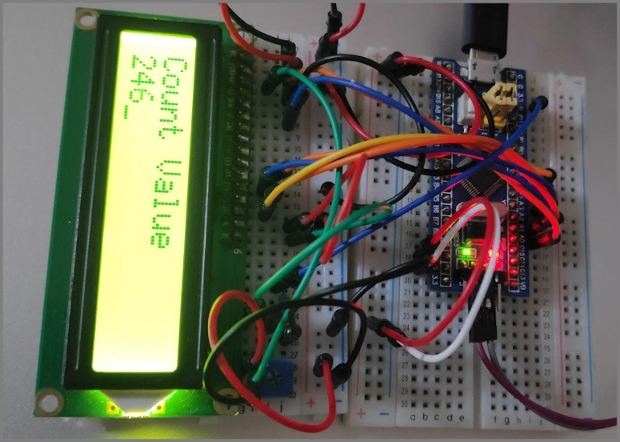
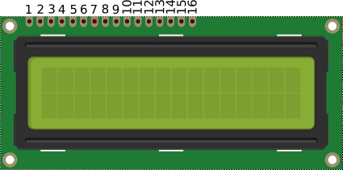
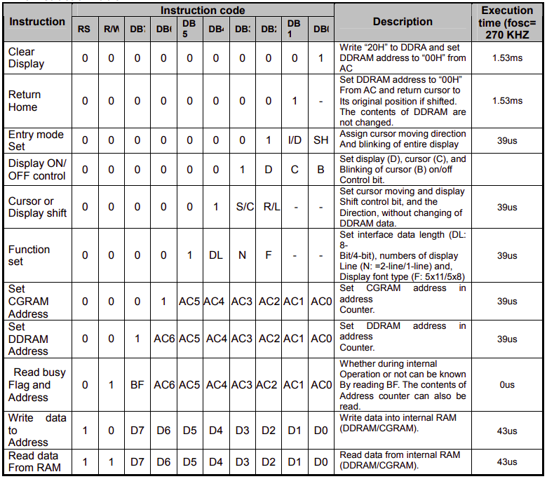

# LCD 16x2 Interfacing with STM32

Small displays are awesome for displaying data for any Embedded System. It is always fun to play around these displays.

  

## Table of Contents
- [LCD 16x2 Interfacing with STM32](#lcd-16x2-interfacing-with-stm32)

  - [Table of Contents](#table-of-contents)

  - [About this Article](#about-this-article)

  - [Getting Started with LCD 16x2](#getting-started-with-lcd-16x2)

  - [LCD 16x2 Pin Map](#lcd-16x2-pin-map)

  - [LCD 16x2 Configuration Commands/Instructions](#lcd-16x2-configuration-commands/instructions)

  - [LCD 16x2 Commands Sequences](#lcd-16x2-commands-sequences)

  - [Acknowledgements and Resources](#acknowledgements-and-resources)
  - [License](#license)

   

## About this Article

- In this article we will be exploring one of such LCD display that is alphanumeric LCD 16x2, its Pin map, commands/instruction sets.

- Will be interfacing it with STM32 and writing driver for its working.

 

## Getting Started with LCD 16x2

Alphanumeric LCD are available in different sizes in terms of rows and columns, for example 16x1, 16x2, 20x4 etc. All these LCD display works with same principle except they can show less or more content.

LCD 16x2 is one of the most popular display in Embedded systems.

>Where 16 x 2 means
>
>-  16 columns or 16 character
>
>-  2 rows or 2 lines
>
>Thus LCD 16 x 2 can show 16 characters in each of the 2 rows (lines).

 

## LCD 16x2 Pin Map

  

 

**Pin Description**

| Pin Number | Symbol | Pin Function |
|---|---|-----|
| 1 | VSS | Ground |
| 2	| VCC|+5v|
| 3	|VEE	|Contrast adjustment (VO)|
|4	|RS	|Register Select. 0:Command, 1: Data|
|5	|R/W |Read/Write, R/W=0: Write & R/W=1: Read|
|6	|EN	|Enable. Falling edge triggered|
|7	|D0	|Data Bit 0 (Not used in 4-bit operation)|
|8	|D1	|Data Bit 1 (Not used in 4-bit operation)|
|9	|D2	|Data Bit 2 (Not used in 4-bit operation)|
|10	|D3	|Data Bit 3 (Not used in 4-bit operation)|
|11	|D4	|Data Bit 4|
|12	|D5	|Data Bit 5|
|13	|D6	|Data Bit 6|
|14	|D7	|Data Bit 7/Busy Flag|
|15	|A/LED+	|Back-light Anode(+)|
|16	|K/LED-	|Back-Light Cathode(-)|

 

>Please Note: In this article we are only interested in Displaying Data (Data Write), thus R/W pin is connected to ground permanently (ie For data Write R/W should be Low).

 

## LCD 16x2 Configuration Commands/Instructions

Below is the image of some of the commands given in datasheet.

  

***Lets Simplify these Commands***

// Define Data Length, Number of Display Lines and Display font type (5x11/5x7)

- For 8-Bit Mode (Data Length), 2-Display lines & 5 x 8 Display font type

    - Command: 0 x 38

- For 4-Bit Mode (Data Length), 2-Display lines & 5 x 7 Display font type

    - Command: 0 x 28

// Define Display (ON/OFF), Cursor (ON/OFF) and Cursor Blink (ON/OFF)

- For Display ON, Cursor ON & Cursor Blink ON 

    - Command: 0 x 0F

- For Display ON, Cursor OFF & Cursor Blink OFF 

    - Command: 0 x 0C

// Define Entry Mode

- For Increment Cusor and No Shift

    - Command: 0 x 06 Acknowledgements and Resources

// Cursor Positions

- For Cursor position to begining of First row/line

    - Command: 0 x 80

- For Cursor position to begining of Second row/line

    - Command: 0 x C0

// Clearing Screen

- For Clearing Screen

    - Command: 0x01

 

## LCD 16x2 Commands Sequences

### **Initializing LCD - 4-Bit Mode**

 

>To initialize LCD, send the following commands to it
>
>- 0x28: for 4-bit data Length, 2-lines & 5x7 font type initialization.
>
>- 0x0C for LCD display On, Cursor Off & Cursor Blink Off.
>
>- 0x06 for Increment Cursor & No Shift.
>
>- 0X01 for clearing the display of the LCD.
>
>- 0x80 for positioning the cursor at first line .

 

### **Sending Command in 4-Bit Mode**
 
 

>- Place higer nibble on data lines.
>
>- Write Low to RS Pin of LCD. (RS = 0)
>
>- Send High to Low pulse on EN Pin of LCD. (EN = 1; delay (15); EN = 0)
>
>- Place lower nibble on data lines.
>
>- Send High to Low pulse on EN Pin of LCD. (EN = 1; delay(15); EN = 0)

 

### **Sending Data in 4-Bit Mode**
 
 

>- Place higer nibble on data lines.
>
>- Write High to RS Pin of LCD. (RS = 1)
>
>- Send High to Low pulse on EN Pin of LCD. (EN = 1; delay(15); EN = 0)
>
>- Place lower nibble on data lines.
>
>- Send High to Low pulse on EN Pin of LCD. (EN = 1; delay(15); EN = 0)

 

## Acknowledgements and Resources

 

## License

- Distributed under the  [CC BY-SA 4.0](https://creativecommons.org/licenses/by-sa/4.0/) license.

  

