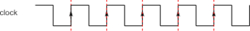
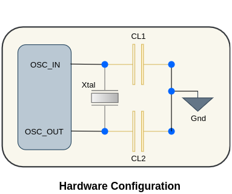
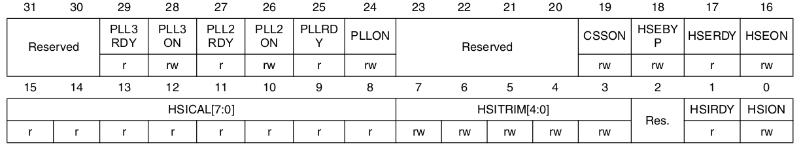

 

# Clock System of STM32F103XX

- Microcontroller (MCU) is a synchronous digital circuit and it is synchronous to clock. 

- Clock is heart beat to the MCU (we can undertand it as an analogy w.r.t. Human Body consiting of a Heart which beats to pump in and out the blood to whole body and thus providing the energy to do work), without it MCU can do nothing.

 

### ***What is Clock?***

Clock is Square Wave signal of certain frequency with 50% duty cycle (For total time Period it will be Half Time ON and Half Time OFF).

  

In the above image arrow indicates the rising edge of the each clock period and we can also understand that with each rising edge there will be execution of new instruction/read or Write operation.

- For different application selecting the right kind of clock is very important. 

- For low power application, we may need to be very carefull  with frequency of clock because there is a relationship b/w power consumption and frequency of clock.

 

### ***Clock Sources***

To generate clock signal we have three main clock sources and any one of these three can be selected.

1. Crystal Oscillator           -> External to MCU      **(HSE: High Speed External Clock)**

2. RC Oscillator                -> Internal to MCU      **(HSI: High Speed Internal Clock)**

3. The PLL (Phase Lock Loop)     -> Internal to MCU to generate higher frequency using either External Crystal/Resonator Oscillator (HSE) or RC Internal Oscillator (HSI).

 

>Please Note: Each of these Clock sources can be Switched ON/OFF idependentally when it is not used, to optimize the power consumption.

 
 
 
 
 
 

## High Speed External (HSE) Clock
#

HSE clock can be generated from two possible external clock sources.

- HSE external crystal/ceramic resonator

- HSE user external clock (Will be not using these, so will talk about these lator)

### ***HSE external crystal/ceramic resonator***

  

In above HSE crystal/resonator hardware configuration we have

- CL1 & CL2 : Loading Capacitors

    (***The value of these loading capacitance must be adjusted according to the selected oscilltor***)

- Xtal: Crystal/resonator

    (***For STM32f103xx 3 to 25 MHz external crystal can be used to produce the accurate main clock***)

 

>Please Note: While designing the application board (PCB), Loading capacitors (CL1 & CL2) and Crystal/Resonator must be placed as close as possible in order to minimize ouput distortion and startup stablization.

 

## What is default Clock configuration of STM32F10xx after power-on/System Reset?

- When MCU udergoes System Reset or powered-on, it will get sarted with **High Speed Internal Oscillator (HSI) as main system clock (SYSCLK)**.

- So lator with code we can change the SYSCLK with something else (for example: HSE or PLL).

- A Switch form one clock source to another will occur only if the target source is ready (clock stable after startup delay or PLL locked) even if the target source which is not yet ready is selected.

- **Status bit** in the **Clock Control Register (RCC_CR)** indicate which clock(s) is (are) ready and which clock is currently used as System Clock.

### **HSE crystal/resonator Clock Configuration while writing code**

  

In the above Clock Control Register (RCC_CR) for HSE Clock Configuration we have

>***HSEON (HSE Clock Enable Bit)***
>- 0: HSE Oscillator OFF
>- 1: HSE OScillator ON
>
>Cleared by hardware to stop the HSE oscillator when entering Stop or Standby mode. This
bit cannot be reset if the HSE oscillator is used directly or indirectly as the system clock.

 

>***HSERDY (HSE Ready Flag)***
>- 0: HSE Oscillator not ready
>- 1: HSE Oscillator ready
>
>Set by hardware to indicate that the HSE oscillator is stable. This bit needs 6 cycles of the
HSE oscillator clock to fall down after HSEON reset.

