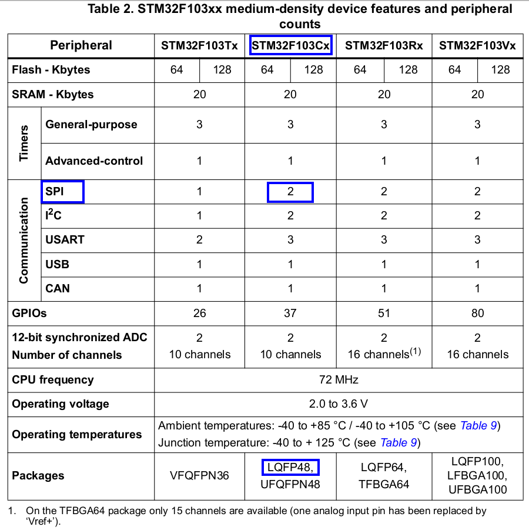

# STM32 SPI implementation

We had previously tried to understand the general concept about [Serial Peripheral Interface (SPI)](Serial_Peripheral_Interface.md). 

In this article will try to understand how we can implement the Bare Metal SPI Peripheral Communication on STM32F103xx.

> Basically we will be writing the SPI Peripheral Driver at register level. Will be implementing the several APIs which can be called in our main program for SPI communication.

<p align="center">
  
</p>


## Table of Contents
- [STM32 SPI Implementation](#stm32-spi-implementation)

  - [Table of Contents](#table-of-contents)

  - [Knowing SPI features on STM32F103xx](#knowing-spi-features-on-stm32f103xx)

  - [ARM Bus Connecting SPI Peripherals](#arm-bus-connecting-spi-peripherals)

  - [SPI Driver APIs Requirement](#spi-driver-apis-requirement)

  - [SPI Peripheral User Configurable Items](#spi-peripheral-user-configurable-items)

  - [Writing SPI register Definition Structure](#writing-spi-register-definition-structure)

  - [Writing SPI Config structure and Handle Structure](#writing-spi-config-structure-and-handle-structure)

  - [Writing APIs Decalaration to SPI Driver Header File](#writing-apis-decalaration-to-spi-driver-header-file)

  - [Acknowledgements and Resources](#acknowledgements-and-resources)

  - [License](#license)


<br>

## Knowing SPI features of STM32F103xx

Lets get into the STM32F103xx datasheet to know more about the SPI peripheral.

Remember to look carefully for the parameters as per your MCU part number, In this case our MCU part number is STM32F103C8T6. Therefore we will look into STM32F103Cx column.
Also Note that this MCU falls under Medium-Density Device so select table accordingly.
 
<p align="center">
  
</p>

Table 2 of the datasheet tell us about the SPI peripheral count available on our MCU.

> Thus in our case 2 (Two) separte SPI peripherals are available.

By looking into the STM32F103xx reference manual we will came to know about SPI features, here is snapshot from reference manual.

<p align="center">
  
</p>

Donot worry just read them once and while implementing the driver will try to understand these features.

## ARM Bus Connecting SPI Peripherals

It is very important to know on which buses SPI peripherals are hanging.

Lets look at STM32F103xx block diagram in its datasheet.
Here is the sanpshot.

<p align="center">
  
</p>

>In the block diagram it is clearly visible that
>
>- **SPI 1 is hanging on APB2 Bus**
>
>- **SPI 2 is hanging on APB1 Bus**

## SPI Clock Frequency on STM32

We have recently explored that SPI 1 is hanging on APB2 Bus and SPI 2 is hanging on APB1 Bus.

So now again bringing these bus into concern for calculating the maximum SPIx Clock frequency can be availed on STM32.

If we look again in the block diagram for SPIx bus, we will notice the following:

> SPI 1 is hanging on APB2 whose max frequency given is
>
>-  **APB2 F(max) = 72 MHz**
>
> SPI 2 is hanging on APB1 whose max frequency given is 
>
>-  **APB1 F(max) = 36 MHz**

To understand this further lets look at the ***Clock Tree*** of STM32F103xx.

**The Max CPU frequency on STM32F103xx is 72 MHz availed with the help of PLL mechanism.**

<p align="center">
  
</p>

In the above clock tree we are using 8 MHz external xtal as clock source which is with the help of PLL multiplier raised to 72 MHz. 

> Now this 72 MHz clock is given to both APB1 and APB2 peripherals.
>
>-  For APB2 the Max 72 Mhz Clock Frequency is allowed so with APB2 prescalar of 1, its peripheral can operate on Max 72 Mhz.
>
>-  For APB1 the Max 36 MHz Clock Frequency is allowed so with APB2 prescalar of 2, its peripheral can operate on Max 36 Mhz.

If we try to use APB1 prescalar of 1 for 72 MHz input clock then it will show error as max APB1 clock frequency allowed is 32 MHz.

Check out below snapshot:

<p align="center">
  
</p>

> Please Note: We can configure the SPI 1 and SPI 2 clock frequency below their Max Clock frequency with the help of APB1 and APB2 prescalar, different clock source, etc.

<br>

**So far we have understood the SPI peripheral count, SPIx peripheral hanging on APB1 and APB2 bus and the max clock frequency they can operate on. Lets move further towards writing the driver for SPIx peripherals.**


## SPI Driver APIs Requirement

For establishing a successfull communication between the Master (MCU) and Slave devices (Sensors, Modules etc) we need to write several general purpose SPI APIs. 

So the required SPI Peripheral APIs are as follows:

**1. SPI Init and SPI Peripheral Clock Control**

**2. SPI Data Transmission**

**3. SPI Data Reception**

**4. SPI Interrupt Configuration and Handling**

**5. Other SPI Management APIs**


## SPI Peripheral User Configurable Items

We have planned the required SPI APIs, simillarly we have to figure out the user configurable items which will help in configuring the SPI communication between the Master and Slave.

The required User Configurable items are as follows:

**1. SPI Device Mode**

- The device (MCU) will act as an Master or Slave.

**2. SPI Bux Congiguration**

- Weather SPI will communicate in fullduplex or Simplex mode.

**3. SPI Data Frame Format**

- Configuring the Tx/Rx Data frame format (8-Bit or 16-Bit).

**4. SPI Clock Polarity**

- Configuring the idle state of the clock (idle LOW (Non-Inverted) or idle HIGH (Inverted)).

**5. SPI Clock Phase**

- Configuring the Data Sampling edge (Leading edge or Trailing edge).

**6. SPI Slave Management**

- Configuring the Slave Management (S/W or H/W Slave Management).

**7. SPI Clock Speed**

- Configuring the SPI Serial Clock frequency


## Writing SPI Register Definition Structure

Lets look at the SPI Registers in the STM32F103xx Reference Manual we will be configuring these register as per our user configuarable items. 

<p align="center">
  
</p>

At first we have to add the addresses of these registers in our ***target (STM32f103xx.h) header*** file by creating a SPI register definition structure.

We have to form the address of these register with the help of their Offset adresses and the Base Address of APB1 and APB2 bus.

Lets get into writing this part of code.

```C

/*
*   So in STM32F103xx.h target header file we willbe   *   adding the following things
*   
*   1. Defining the Base Address of SPIx using their Bus Base address
*
*   2. Defining the SPI Register Definition Structure (SPI_RegDef_t) with all SPI registers offset 
* addresses matched to the index of structure
*
*   3. Typecast the SPIx Peripheral base addresses to SPI_RegDef_t structure variable.
*
*   4. Defining the SPIx Peripheral Clock Anable and Disable Macros.
*
*   5. Defining the SPIx Peripheral Reset Macros.
*/


#define PERIPH_BASEADDR		    0x40000000U		// Base Address of Peripheral

#define APB1PERIPH_BASEADDR     PERIPH_BASEADDR		// Base Address of APB1 bus

#define APB2PERIPH_BASEADDR    (PERIPH_BASEADDR + 0x00010000U)	// BAse Address of APB2 Bus

#define SPI1_BASEADDR	(APB2PERIPH_BASEADDR + 0x00003000U)		// Base Address of SPI1

#define SPI2_BASEADDR	(APB1PERIPH_BASEADDR + 0x00003800U)	// Base address of SPI2

/*
* Registers Definition of a SPI peripheral of        
* STM32F103xx MCU
*/

typedef struct
{                           //  Offset Address
	__vo uint32_t CR1;      //  0x00
	__vo uint32_t CR2;      //  0x04
	__vo uint32_t SR;       //  0x08
	__vo uint32_t DR;       //  0x0C
	__vo uint32_t CRCPR;    //  0x10
	__vo uint32_t RXCRCR;   //  0x14
	__vo uint32_t TXCRCR;   //  0x18    
	__vo uint32_t I2SCFGR;  //  0x1C
	__vo uint32_t I2SPR;    //  0x20
}SPI_RegDef_t;

/*
 * Peripheral definition (Peripheral base addresses * * type casted to xxx_RegDef_t)
 */
#define SPI1    ((SPI_RegDef_t*) SPI1_BASEADDR)

#define SPI2	((SPI_RegDef_t*) SPI2_BASEADDR)

/*
 * Clock Enable Macros for SPIx peripherals
 */

#define SPI1_PCLK_EN()		(RCC->APB2ENR |= (1<<12))
#define SPI2_PCLK_EN()		(RCC->APB1ENR |= (1<<14))

/*
 * Clock Disable Macros for SPIx peripherals
 */

#define SPI1_PCLK_DI()		(RCC->APB2ENR &= ~(1<<12))
#define SPI2_PCLK_DI()		(RCC->APB1ENR &= ~(1<<14)) 

/*
 * Macros to reset SPIx peripherals
 */

#define SPI1_REG_RESET()    do{ 
                                (RCC -> APB2RSTR |=   (1<<12)); 
                                (RCC -> APB2RSTR &= ~(1<<12)); 

                              }while(0)

#define SPI2_REG_RESET()	do{ 
                                (RCC -> APB1RSTR |= (1<<14)); 
                                (RCC -> APB2RSTR &= ~(1<<14	)); 

                              }while(0)

```


## Writing SPI Config structure and Handle Structure 
Cool so we have added the required code for SPI Peripherals in the MCU target file now lets move further and create SPI driver file (STM32F103xx_SPI_driver.h) in which we will be creating two Structures:

- Config Structure (This structure helps with User Configurable Items)

- Handle Structure (This structure will handle RegDef and config structure)


```C

#ifndef STM32F103XX_SPI_DRIVER_H_
#define STM32F103XX_SPI_DRIVER_H_

#include "STM32f103xx.h"					// including target header file


/*
 * Configurable structure for SPI
 */

typedef struct
{
	uint8_t SPI_Mode;       // master/slave mode
	uint8_t SPI_BusConfig;  // FDD/SD   
	uint8_t SPI_CLKSpeed;   // Clock Speed
	uint8_t SPI_DataFormat; // 8-Bit/16-Bit
	uint8_t SPI_CPHASE;     // Leading edge/trailing edge
	uint8_t SPI_CPOL;       // Idle State (LOW/HIGH)
	uint8_t SPI_SlaveMgmt;  // Hardware / Software Slave Management
}SPI_Config_t;

/*
 * Handle structure for SPI
 */

typedef struct
{
	// pointer to hold the base address of SPI Peripheral
	SPI_RegDef_t *pSPIx;	// This hold the base address of SPIx
	SPI_Config_t SPI_Config;

}SPI_Handle_t;


#endif /* STM32F103XX_SPI_DRIVER_H_ */

```

## Adding Macros to SPI Driver Header File

Now we will add required User Configuration Setting macros and SPI Flag Macros for easy writing of code to the same ***STM32F103xx_SPI_driver.h*** file.

```C

/******************************************************************************************************
 * 		Macros for SPI (User Configuration Setting Macros, SPI Flag Masking Macros)
 *****************************************************************************************************/

// SPI Mode Select macros
#define SPI_MODE_MASTER				1
#define SPI_MODE_SLAVE				0

// Bus Config Macros
#define SPI_BUS_CONFIG_FD			1
#define SPI_BUS_CONFIG_HD			2
#define SPI_BUS_CONFIG_SIM_RXONLY 	3

// SPI CLock Baudrate Selction Macros
#define SPI_CLKSPEED_FPCLK_2			0
#define SPI_CLKSPEED_FPCLK_4			1
#define SPI_CLKSPEED_FPCLK_8			2
#define SPI_CLKSPEED_FPCLK_16			3
#define SPI_CLKSPEED_FPCLK_32			4
#define SPI_CLKSPEED_FPCLK_64			5
#define SPI_CLKSPEED_FPCLK_128			6
#define SPI_CLkSPEED_FPCLK_256			7

// Data Frame Format Macros
#define SPI_DFF_8BIT				0
#define SPI_DFF_16BIT				1

// CPOL and CPHASE Macros
#define SPI_CPOL_0_IDLE				0
#define SPI_CPOL_1_IDLE				1

#define SPI_CPHASE_DATA_LEAD_EDGE	0
#define SPI_CPHASE_DATA_TRAIL_EDGE	1

// Slave Management Macros
#define SPI_SSM_DI					0
#define SPI_SSM_EN 					1

// SPI Enable Macros
#define SPI_EN						1
#define SPI_DI						0


// Other Macros


// SPI FLAG MASKING MACROS
#define SPI_TXE_FLAG	(1 << SPI_SR_TXE)			// TX Buffer Empty Flag
#define SPI_RXNE_FLAG	(1 << SPI_SR_RXNE)			// RX Buffer Empty Flag
#define SPI_BSY_FLAG	(1 << SPI_SR_BSY)			// SPI Communication Busy Flag

```

<br>

## Writing APIs Decalaration to SPI Driver Header File

Okay so now we have decalare the SPI APIs in the same **STM32F103xx_SPI_driver.h*** file. Hope we remember the section [SPI Driver APIs Requirement](#spi-driver-apis-requirement), where we put a thought on required APIs to setup successfull communication betwwen master and slave.

Lets decalare the SPI APIs:

```C

******************************************************************************************************
 * 							APIs Supported by this driver
 * 			For more details about APIs check the function definitions in STM32f103xx_SPI_driver.c
 *
 *****************************************************************************************************/

/*
 * Init and Deint SPIx
 */

void SPI_Init(SPI_Handle_t *pSPIHandle);
void SPI_DeInit(SPI_RegDef_t *pSPIx);

/*
 * SPI Get Status Flag
 */
uint8_t SPI_GetFlagStatus(SPI_RegDef_t *pSPIx, uint32_t FlagName);

/*
 * SPI Peripheral Clock Setup
 */

void SPI_PeriClkControl(SPI_RegDef_t *pSPIx, uint8_t EnorDi);

/*
 * SPI Peripheral Enable or Disable
 */
void SPI_PeriControl(SPI_RegDef_t *pSPIx, uint8_t EnorDi);

/*
 * SPI SSI Configuration
 */
void SPI_SSIConfig(SPI_RegDef_t *pSPIx, uint8_t EnorDi);

/*
 *  SPI Data Read and Write
 */
void SPI_WriteData(SPI_RegDef_t *pSPIx, uint8_t *pTxBuffer, uint32_t Len);
void SPI_ReadData(SPI_RegDef_t *pSPIx, uint8_t *pRxBuffer, uint32_t Len);

/*
 *  SPI IRQ Configuration and ISR Handling
 */
void SPI_IRQInterruptConfig(uint8_t IRQNumber, uint8_t EnorDi);
void SPI_PriorityConfig(uint8_t IRQNumber, uint32_t IRQPriority);
void SPI_IRQHandling(SPI_Handle_t);


```

