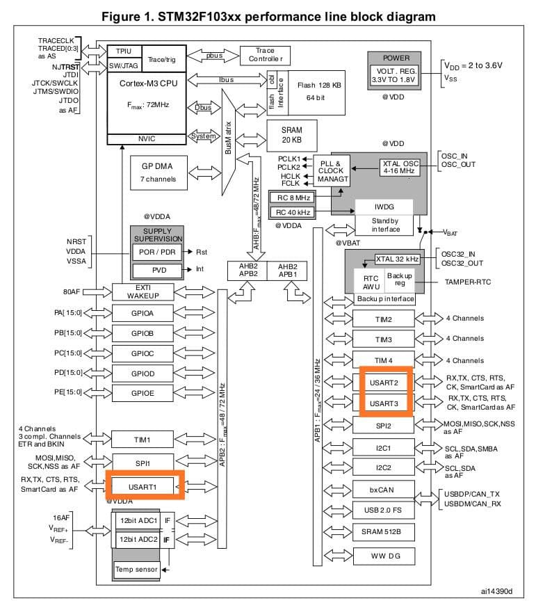
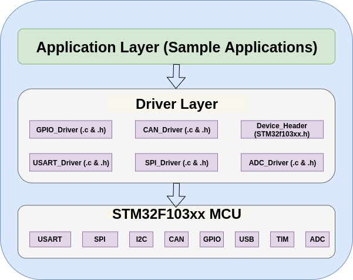

# USART Driver Development

Lets dive into developing the USART Driver for STM32.

At first lets look at block diagram of STM32F103XX given in datasheet.

<p align="center">
  
</p>

From this block diagram we can clearly see, STM32F103xx MCUs have three USARTs (USART 1, USART 2, USART 3).

- USART 1 is hanging on APB2 Bus.

- USART 2 and USART 3 are hanging on APB1 Bus.

> Here it is important to note the Bus for each of the USART is hanging on in order to enable the USART clock. 

## Code Development Layers 
Lets understand different layers of Code requirements.

<p align="center">
  
</p>

So inside the Hardware layer (ie STM32F103xx MCU) we have different peripherals such as GPIOs, ADC, Timers, I2C, SPI, USART etc.

To use these peripherals and configure them as per application it is always good to write a driver for them and then accessing their drivers API function to call them in sample application code.

So here we will be writing USART driver, starting with ***User Configurable Items***.

## User Configurable Items

The followings will be the User Configurable Items for USART peripheral while writing an application for it.

**1. USART_Mode** 
>- Transmit Mode (Half Duplex)
>
>- Recieve Mode (Half Duplex)
>
>- Transmit Recieve Mode (Full Duplex)

**2. USART_BaudRate**
>- Mention the Baud Rate for communication

**3. USART_NoOfStopBits**
>- Configure the Number of Stop bits required.
>
>- Stop Bit: 1 or 2 or 
>   - 1.5 or 0.5 (Smartcard Mode)

**4. USART_WordLength**
>- Configure the word length for the data.
>
>- Word Length: 8-Bits or 9-Bits

**5. USART_ParityControl**
>- Configure the Parity Control bit for error detection.
>
>- Parity Control - No Parity or Even Parity or Odd Parity

**6. USART_HWFlowControl**
>- Configure the Hardware Flow Control.

## Required APIs for USART Driver

Now its time to indentify the required APIs for USART driver Development, these APIs are followings:

- USART Initialization

- USART Transmit

- USART Recieve

- USART Interrupt Configuartion and Handling

- Other USART Management APIs

## USART Configuration Structure

Lets write a configuration structure for USARTx peripheral.

```C
    /*
    * Configuration Structure for USARTx peripheral
    */

    typedef struct
    {
        uint8_t USART_Mode;       //config in USART_CR1 register
        uint32_t USART_BaudRate; //config in USART_BRR register
        uint8_t USART_NoOfStopBits; //config in USART_CR2 register
        uint8_t USART_WordLength; //config in USART_CR1 register
        uint8_t USART_ParityControl; //config in USART_CR1 register
        uint8_t USART_HWFlowControl;  //config in USART_CR3 register
    } USART_Config_t;
``` 

## USART Handling Structure

Lets write a Handling structure for USARTx peripheral.

```C
    /*
    * Handling Structure for USARTx peripheral
    */

    typedef struct
    {
        USART_RegDef_t *pUSARTx;    // will pass the USARTx (x = 1 or 2 or 3) address here
        USART_Config_t USART_Config;

    } USART_Handle_t;
``` 

>Please Note: The above two structures (USART Configuration Structure and USART Handling Structure) will be written in **STM32f103xx_USART_Driver.h** file (one can use any name for USART driver header file).

## Implementing the Driver

1. Create USART Driver Header file and Source file in the driver folder.
>- STM32f103xx_USART_driver.h
>
>- STM32f103xx_USART_driver.c

2. Create the USART register definition structure and other macros in MCU specific header file (STM32f103xx.h).

>- ***Macros***
>
>   - Peripheral base addresses
>
>   - Device Definition
>
>   - USART Clock Enable
>
>   - USART Clock Disable
>
>   - USART register Bit Definition
>
>-  ***Create USART register Definition Structure***
>
>       - USART_RegDef_t

3. Create USART Configuration and USART Handle structure in USART Driver Header file.

> As defined in 
>
>   - [USART Configuration Structure](#usart-configuration-structure)
>   - [USART Handling Structure](#usart-handling-structure)

<br>

### Writing the APIs Prototypes

```C
    /*
    * USART Peripheral Clock Enable or Disable API
    */
    void USART_PeriClockControl(USART_RegDef_t *pUSARTx, uint8_t EnOrDi);

    /*
    * USART Peripheral Clock Enable or Disable API
    */
    void USART_PeripheralControl(USART_RegDef_t *pUSARTx, uint8_t EnOrDi);


```