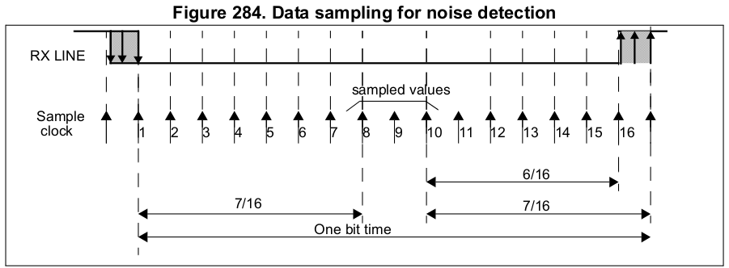
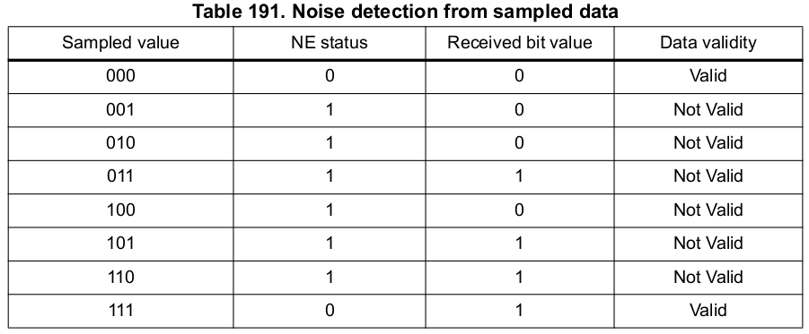
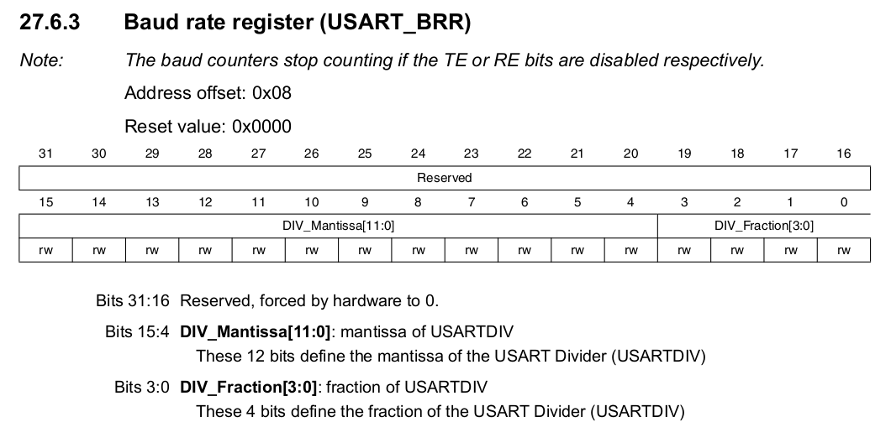

# STM32 UART and USART Peripheral

***UART*** is Universal Asynchronous Reciever and Transmitter.

***USART*** is Synchronous and Asynchronous Reciever and Transmitter.

- USART and UART are inbuit peripheral hardware which converts parallel data into serial data.

- UART only support Asynchronous mode.

- USART supports both Synchronous and Asynchronous mode.

    - In Synchronus mode, the clock is sent separately from data stream and no start/stop bits are used.

>All MCUs comes with USART module so we can use it in both synchronous mode as well as asynchronus mode.

***There is no specific port for USART communication. They are commonly used in conjugation with protocols like RS-232, RS-434, USB, etc.***

## USART Hardware Components

- Baud rate generator
- TX and Rx     

## Steps for Data Transmission

- Program the M-Bit in USART_CR1 to define the word length.

- Program the number of stop bits in USART_CR2 register.

- Select the desired Baud Rate using USART_BRR register.

- Set the TE bit in USART_CR1 to enable the transmit block.

- Enable the USART by writing the UE bit in USART_CR1.

- Now if TXE flag is set, then write the data byte to send, in the USART_DR register.

- After writing the last data into the USART_DR register, wait until TC=1 (Transmission complete Flag).

## Steps for Data Reception

- Program the M-Bit in USART_CR1 to define the word length.

- Program the number of stop bits in USART_CR2 register.

- Select the desired Baud Rate using USART_BRR register.

- Enable the USART by writing the UE bit in USART_CR1.

- Set the RE bit in USART_CR1 to enable the Reciever block.

- When a character is recieved, wait till the RXNE bit is set and read the data byte from the data register.

- The RXNE bit must be cleared by reading the data register, before the end of the reception of the next chapter to avoid an overrun error. 

Instead on polling on RXNE flag we can also get an interrupt by enabling this interrupt.

## USART Oversampling

Oversampling is the technique used by the recieve engine to recover incoming data on Rx line by discriminating between valid incoming data and noise.

Reciever has different user-configurable oversampling feature. The oversampling rate can be selected by programing the ***OVERB*** bit in the **USART_CR1** register and can be either 16 or 8 times the baud rate clock.

What does oversampling of data means?

**Oversampling by 16**

  

- It simply means reciever engine samples each bit 16 times to understand weather this bit is either 1 or 0.

- After taking 16 samples during one bit period, the three center samples (8th, 9th and 10th) are analysed.

**Oversampling by 8**

- In this case the reciever engine sapmles the incoming bit on Rx line 8 times.

- After taking 8 samples during one bit period, the three center samples (4th, 5th and 6th) are analysed.

By using sample data the USART engine understand wheather it is user data or noise.

  

If any of the sampled value for both the case of oversampling (by 16 or 8) does not match then it sets the NE flag in the ***STATUS*** register and considered as a Noise Error. 

Table given above shows when sampled values gives you Data Validity and when Noise error.

The invalid data is transferred from the shift register to the **USART_DR** register.

The application may consider or discrad the frame based on application logic.

 

## Selecting Proper Oversampling Method

1. If **Oversampling by 8 (OVER8 = 1)** is selected then the ***maximum baudrate*** can be achieved up to 

>### **F(pclk) / 8**
>
> ***But the maximum reciever tolerance to clock deviation is reduced.***

2. If **Oversampling by 16 (OVER8 = 0)** is selected then the ***maximum baudrate*** can be achieved up to 

>### **F(pclk) / 16**
>
> ***The maximum reciever tolerance to clock deviation is increased.***

### Clock Deviation 

The clock deviation can be happened due to different clock sources of the MCU such as Internal RC Oscillator, PLL, External Crystal.

- In case of RC Oscillator Clock deviation is more because it depends on Temperature variation and due to more variaion clock deviation reciever may fail and it will generate noise error for each and every byte reception.

> ### **Thumb Rule**
>
> **1. If USART is needed for very noisy environment then use Oversampling by 16.**
>
>- Low Baudrates to select.
>
>- But increased tolerance to clock deviation
>
>
> **2. If USART is needed for noise free or low noisy environment then use Oversampling by 8.**
>
>- Higher Baudrates to select.
>
>- But reduced tolerance to clock deviation.

## USART Baudrate Calculation

The Baudrate can be set by programming the **Mantissa** and **Fraction** values in ***USARTDIV***.

The baudrate for both reciver and transmitter is same value.

> ### 1. If OVER8 = 1 (Oversampling by 8)
>
> - USART Baudrate  = F(pclk) / (8 x USARTDIV)
>
>
> ### 2. If OVER8 = 0 (Oversampling by 16)
>
> - USART Baudrate  = F(pclk) / (16 x USARTDIV)
>
> Where USARTDIV = Divide factor to generate different baudrates.

### Generic Expression for Baudrate Calculation

> -------------------------------------------------
>
> ### **USART Baudrate  = F (pclk) / (8 * (2-OVER8) x USARTDIV)**
>
> -------------------------------------------------
> OVER8 = 1, if Oversampling by 8 is selected
>
> OVER* = 0, if Oversampling by 16 is selected
>
> **Lets do some Baudrate Calculation**
>
> Say we desired following config
>
> -  Baudrate = 9600 bps
>
> - F(pclk) = 16Mhz (USART Peripheral Clock)
>
> - OVER8 = 0 (Oversampling by 16)
>
> ***So USARTDIV = F (pclk) / (8 * (2 - OVER8) * Baudrate)***
>
> - USARTDIV =  (16 * 1000000) / (16 * 9600)
>
> - ### ***USARTDIV = 104.17***
>
> ### **We have program this value in USRAT_BRR register**
>
> - First we have to convert USARTDIV value into hexadecimal 
>
>   - USARTDIV  = 104.17  (This is Decimal Value)
>
>   - USARTDIV_Mantissa = 104 = 0x68
>
>   - USARTDIV_Fraction = 0.166667 = 2.6, Consider it 3
>
>   - Therefore USARTDIV = 0x683
>
> - USART uses fractional baudrte generator with 12-bit Mantissa and 4-bit fraction
> ------------------------------------------------

  

As per above image form MCU reference manual we have to program the DIV_Mantissa and DIV_Fraction value as per our desired baudrate.

> For the case of 9600 baudrate, F(pclk) = 16Mhz and OVER8 = 0
>
> Div_Mantissa = 0x068;
>
>Div_Fraction = 0x3;

