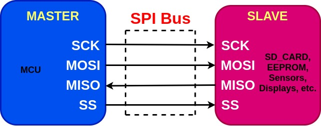
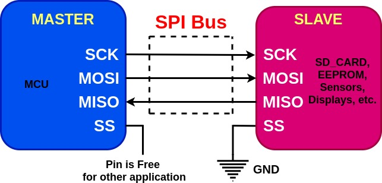
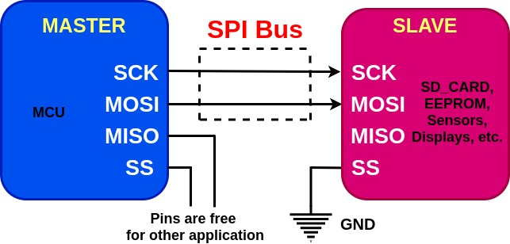
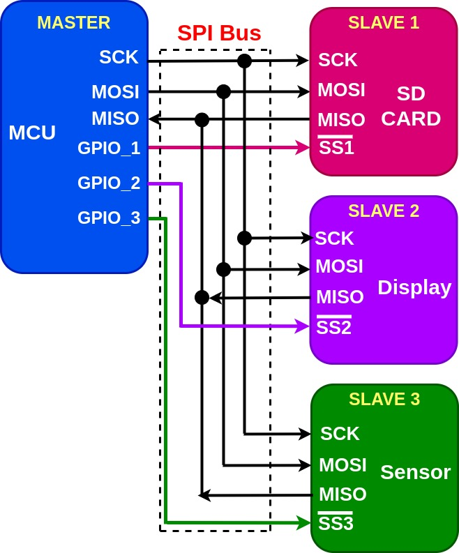
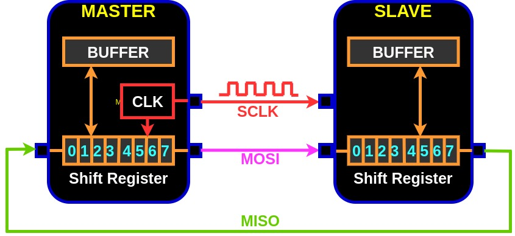
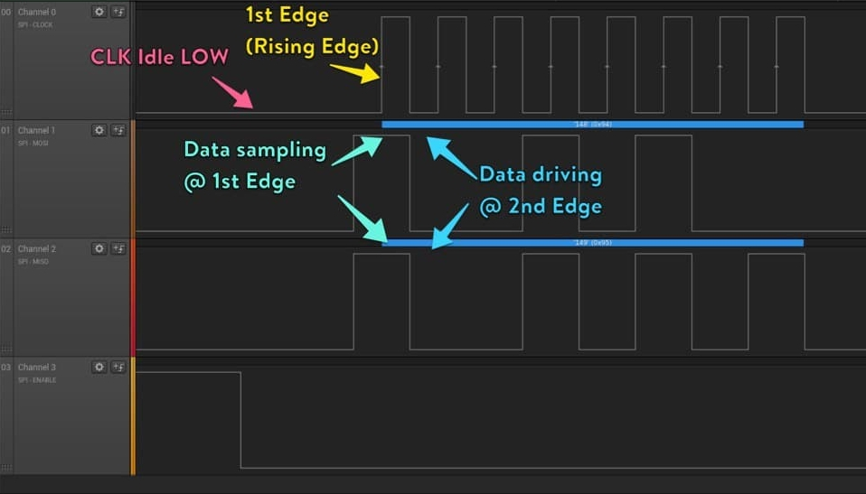
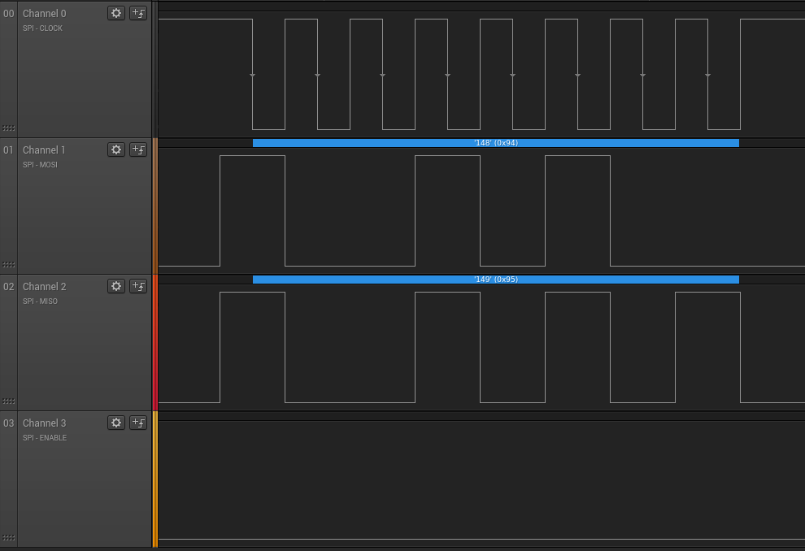
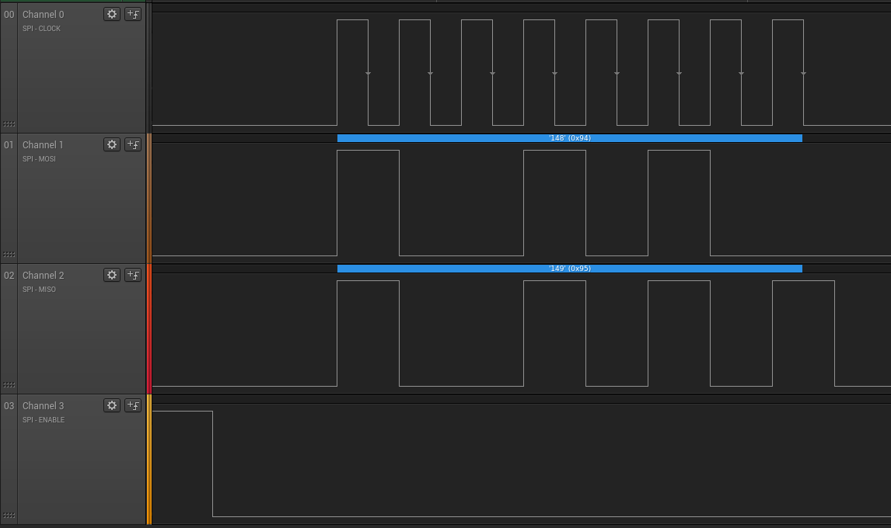
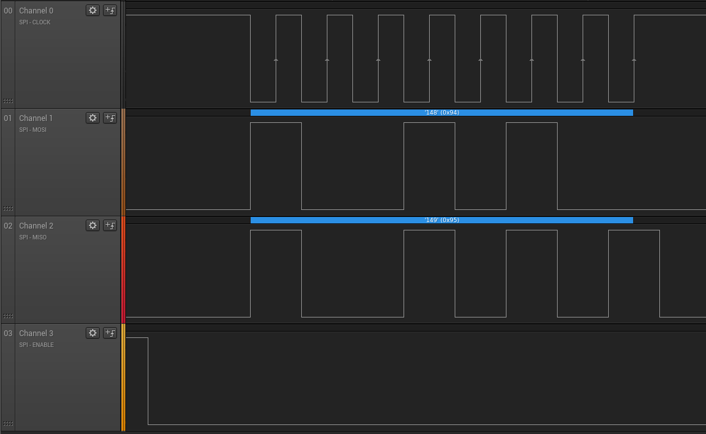

# Serial Peripheral Interface (SPI)

SPI is a one of the serial protocol which is used to communicate between one Master device and one or more Slave devices in Embedded Systems. 

- *Four Wire Communication Protocol*
- *Full-Duplex, Serial Communication Protocol*
- *Synchronous Commuincation Protocol*
- *Single Master Multi Slave*

 

  

Master can be your host microcontroller and slaves can be devices such as SD Card, Ethernet, Sensors, EEPROM etc.

## SPI Bus
Four I/O pins are used for SPI communication.

- ***SCK (Serial Clock)*** : Serial Clock Output by master and input by Slave. 
It carries clock signal from master to slave. The data communication via MOSI and MISO between master and slave is synchronised with the clock. Therefore SPI is also called as Serial Synchronous Communication Protocol. 
**Always master will only generate the clock.**

- ***MOSI (Master Out Slave In)*** : Master Transmit Data and Slave recieve data.

- ***MISO (Master In Slave Out)*** : Slave transmit data and Master recieve data.

- ***SS (Slave Control)*** : It is used to select the individual Slave device for communicating to master.  When more than one Slave device is used then particular slave device SS line is drive to logic low by master .

**If there is only one slave device on SPI bus then the SS pin of the slave device can be pulled down to ground (GND) of the circuit as this will save the GPIO/SS pin on the master for other application.**

  

> SPI is Short Distance and Low Speed Serial Synchronous Communication Protocol.
>
> - **SPI can achieve Maximum Distance upto 10 feet**
>
> - **SPI can achieve Maximum Speed upto Fpclk/2 bps**
>
> SPI communicate over TTL logic in the voltage range 0v to 5v, this is one of the reason for short distance communication.

## SPI Minimal BUS
As we have seen earlier that four wires required for SPI bus (ie SCK, MOSI, MISO and SS) for comunication between a master and one slave but these four wires can also be reduced to 2 wires.

Lets check out how.

  

When a slave device on SPI bus  is capable of only recieving data from master and never send any data back to master thus there is no requirement of connecting MISO pins between that slave and master.

## SPI Slave Selection and Communication

Devices on SPI bus can either operates as Master or Slave. There must be atleast one master who can initiate communication with any of the slave devices.

Whenever there are more than one slave then it becomes realy important to first select the slave with whom master wants to talk. 

  

The Master select the slave for communication by driving that particular slave SS pin to logic low via its GPIO pin and keeping all other slave SS line to logic high.

In this example say master wants to communicate to SLAVE 3 (ie Some Sensor) then at first master needs to select this sensor for communication by driving its GPIO_3 pin to Logic LOW which in turns drive the SS3 pin of SPI Sensor to Logic LOW. And very important the master will also drive GPIO_1 and GPIO_2 to Logic HIGH therefore Slave 1 (SD Card) and Slave 2 (Display) will not get involved while master is talking to SPI Sensor.

## SPI Hardware Architecture

SPI Communication is based on shift register. lets try to understand the internal of SPI Hardware Architecure.

  

At every clock event the data communication will take place  and whenever master send the data to slave via MOSI pin, the master will also recieve data from slave via MISO pin because the shift register of master is connected to shift register of slave in a looping fashion.

That is the LSB of master shift register is connected serially to the MSB of slave shift register via MOSI.

Similarly the LSB of slave shift register is connected to MSB of master shift register via MISO.

> ### In SPI communiaction Clock is only produced when the Data is placed on MOSI Line.

## SPI Communication Configuration

The SPI communication allows the master to communicate using different configurations, depending on the device targeted and the application requirements.

- ***Full Duplex Communication*** : 
By default SPI is configured for full duplex communication.

- ***Half Duplex Communication*** :

- ***Simplex Communication***

## SPI Clock Polarity and Clock Phase 

As we discussed earlier SPI is a Synchrobous protocol which means data is communicated (sampled and driven) between master and slave device is in sync with clock signal.

But how? as we already know clock is a square wave transitioning between HIGH and LOW states. And when we define clock signals in terms of its speed that is say X MHz there are X Mega Clock cycles in a second.

In each clock cycle there is one rising edge and one falling edge. So each clock cycle samples and drive new data (basically a new character).

The data is sampled/driven at certain edge of the clock cycle. Okay cool! time to understand which edge of the clock cycle, is it the rising edge or the falling edge?

Well, this introduces the parameter called *Clock Phase (CPHA)*, which defines following:

- **When CPHA is 0  the data is sampled at first edge.**

- **When CPHA is 1 the data is sampled at second edge.**

Remember this doesn't mean directly with rising and falling edge of the clock but it is relative to the idle state of the clock and this introduces us another parameter called *Clock Polarity (CPOL)*.

CPOL defines what will be idle state (either HIGH or LOW) of clock signal when there is no trnasmission (no exchange of data) between master and slave or vice versa is happening.

- **When CPOL is 0, Idle state of clock is LOW**

- **When CPOl is 1, Idle state of clock is HIGH**

For SPI communication we need to set these two important parameters (CPOL and CPHA) values in the registers.

Lets observe some plots for different combination of CPOL and CPHA.

***1. CPOL = 0 and CPHA = 0***

  

    
  

  > In this case idle state of clock is LOW and data is sampled at first edge (Rising Edge) of the clock and driven (appers/toggling) at the second edge of the clock.

 

***2. CPOL = 1 and CPHA = 0***
  

    
  

  > In this case idle state of clock is HIGH and data is sampled at first edge (Falling Edge) of the clock and driven at the second edge of the clock.

  ***3. CPOL = 0 and CPHA = 1***

  

    
  

  > In this case idle state of clock is HIGH and data is sampled at first edge (Falling Edge) of the clock and driven at the second edge of the clock.

 

***4. CPOL = 1 and CPHA = 1***

  

    
  

  > In this case idle state of clock is HIGH and data is sampled at first edge (Rising Edge) of the clock and driven at the second edge of the clock.

   

  ### ***Conclusion***
    Data Sampling means Data capture at recieving end and Data driving means Data appear/loading on Data (MISO/MOSI) line.
    
    CPHA controls at which clock edge (1st or 2nd) of SCLK (Serial Clock) the data will sample by reciever.

    As per application suitable CPHA and CPOL needs to be selected. For all normal operation CPOL = 0 and CPHA = 1.

  ### Some Important Note Regarding SPI Clock

  > When the data appears/toggle at one of clock edge (Data Loading Edge) must be stablize in some time. This time must be less than and before the Data Sampling Edge because data will be sampled/captured at sampling edge. 
  >
  > Thus to avoid wrong data to be captured at sampling edge, stablization time must be less than the half cycle of the clock signal.
  >
  > If the cable length is very long and at very high speed SPI Clock, the slave device may not see the real data, it may sample some random data. This is also true for noisy environment.
  >
  > When we increase the speed of SPI Clock frequency, the slave will get less amount of time to sample the data transition. Cable length can be increased if we decrease the frequency of the clock.

  ## Slave Selection Management

  In SPI communication, Master can select the slave in two different ways.

  ***1. Hardware NSS Management***: In this mode the actual NSS pin on the Master is used and connected to the SS pin on the Slave device. 

  >In this case 
  >
  > - whenever SPI is enabled, the NSS pin will be pulled LOW automatically and 
  >
  >- whenever SPI is disabled, the NSS pin will be pulled HIGH automatically.

  One important thing here to note is that one NSS pin can control only one Slave device. 

  ***2. Software NSS Management***: In this mode other GPIOs of the MCU (Master) can be used for managing the multiple slave devices without relying on the NSS pin of the Master device.

  As the name suggest we can use any GPIO/GPIOs and control them to select a particular slave device for communication by writing LOW to GPIOs register (via Software).

  So whenever there are more than one slave devices connected to a master device then it is not at all possible to use a H/W NSS pin as it can only manage a single slave device. Therefore Software NSS management is required to assign other GPIOs for selecting a particular slave device by driving corresponding GPIO LOW and rest of the GPIOs to HIGH.

  > Please refer to the STM32_SPI_Implementation for understanding its code development. 

  